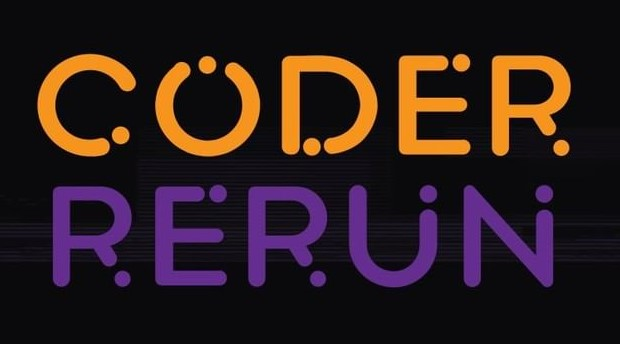

  

  <h4>
     
    É UMA COMPETIÇÃO DE PROGRAMAÇÃO PROMOVIDA PELO RAMO ESTUDANTIL IEEE-UEL.
     
    O OBJETIVO É AUXILIAR A COMUNIDADE A DESENVOLVER E TESTAR SUAS HABILIDADES EM LÓGICA E PROGRAMAÇÃO.
  </h4>

## Exercises
- [X] [A - Jogo dos Copos](https://www.urionlinejudge.com.br/judge/pt/problems/view/3053) | [Solution](https://github.com/LucianoWeslen11/coder_rerun/blob/master/exercises/a_game_of_cups.py)
- [ ] [B - Magic and Sword](https://www.urionlinejudge.com.br/judge/pt/problems/view/2632)
- [ ] [C - Presentes de Natal](https://www.urionlinejudge.com.br/judge/pt/problems/view/3089)
- [X] [D - Navegador Web](https://www.urionlinejudge.com.br/judge/pt/problems/view/2635) | [Solution](https://github.com/LucianoWeslen11/coder_rerun/blob/master/exercises/d_web_browser.py)
- [ ] [E - Problema do 7 x 1](https://www.urionlinejudge.com.br/judge/pt/problems/view/3099)
- [ ] [F - Demogorgon](https://www.urionlinejudge.com.br/judge/pt/problems/view/2532)
- [ ] [G - O Rolê Bad Vibes](https://www.urionlinejudge.com.br/judge/pt/problems/view/2958)
- [ ] [H - Pirâmide](https://www.urionlinejudge.com.br/judge/pt/problems/view/2873)
- [ ] [I - Ih, Ferrou, um Buraco Negro!](https://www.urionlinejudge.com.br/judge/pt/problems/view/1783)
- [ ] [J - O Jogo](https://www.urionlinejudge.com.br/judge/pt/problems/view/2954)
- [ ] [K - Ajude o Nhonho](https://www.urionlinejudge.com.br/judge/pt/problems/view/1919)
- [ ] [L - Brainfuck](https://www.urionlinejudge.com.br/judge/pt/problems/view/1456)
- [ ] [M - Maratona Brasileira de Comedores de Pipocas](https://www.urionlinejudge.com.br/judge/pt/problems/view/2973)
- [ ] [N Recuperação de Arquivos](https://www.urionlinejudge.com.br/judge/pt/problems/view/1335)

## Team
<table>
  <tr>
    <td align="center"> <b><a href="https://github.com/AkiraDemenech" title="Akira">Guilherme A. D. Mori</a></b> UEL</td>
    <td align="center"> <b><a href="https://github.com/lucianoweslen11" title="Akira">Luciano W. da Silva</a></b> IFPR</td>
    <td align="center"> <a href="https://www.linkedin.com/in/kristiano-pasini-10997419a/" title="Luciano">Kristiano Pasini</a></b> UEL</td>
  </tr>
</table>